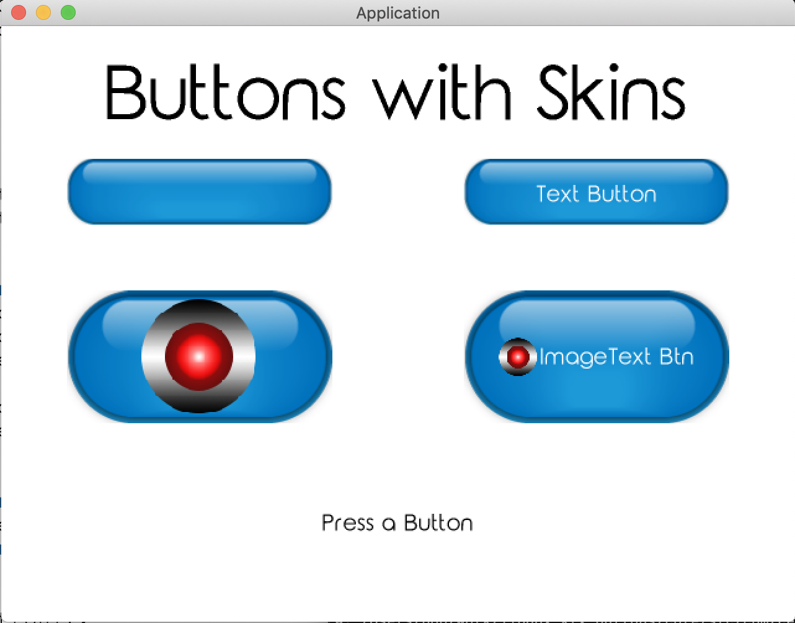

## Fonts and Labels 

LibGDX, game engine written in Java. KTX, Kotlin DSL for LibDGX. 

Third tutorial in the LibGDX series, adapted for Kotlin.
https://libgdx.info/buttons-scene2d/

### About

If you are attempting to learn more about Kotlin and LibGDX this is a great third step, see previous solutions here: https://github.com/bajabob/libgdx-ktx-labels-fonts. This tutorial aims to teach you about LibGDX standard Buttons, TextButtons, ImageButtons and ImageTextButtons.

### Uses 
 
TODO

### Screenshot

### How to Run

Clone or download a zip of the project

From the root of the project, execute: `./gradlew :desktop:run`